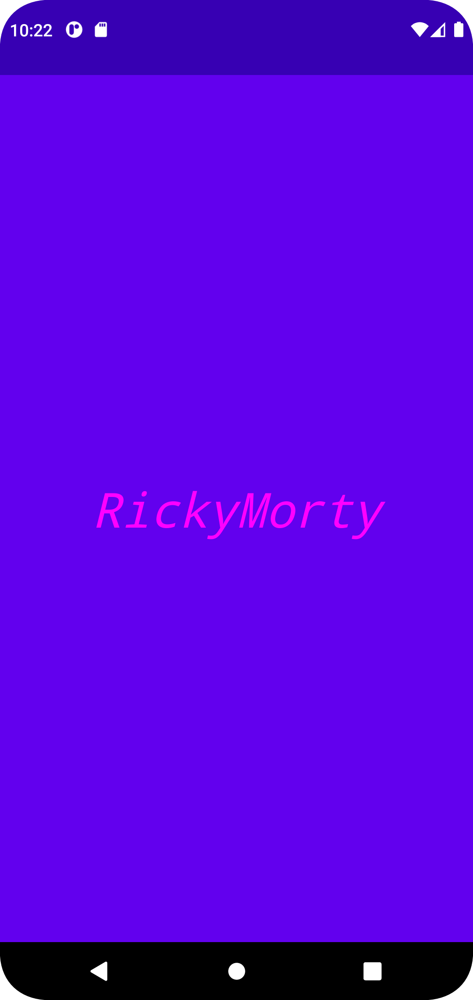
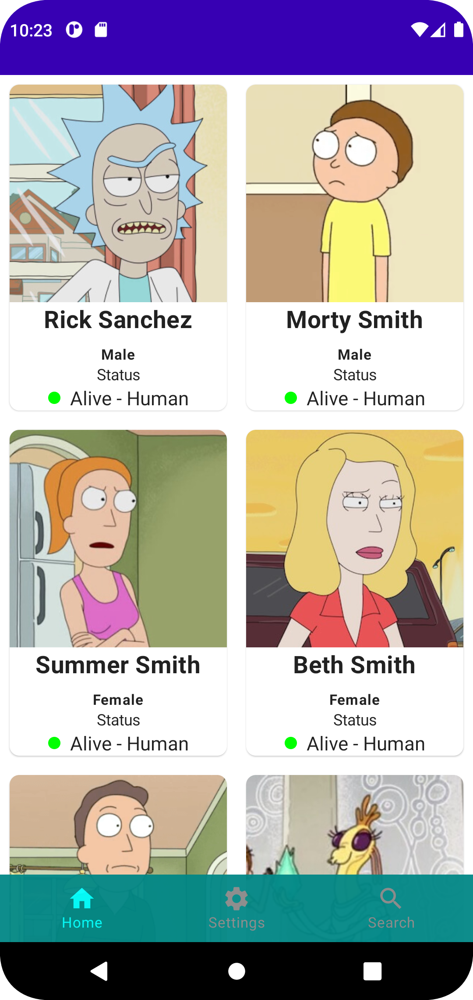
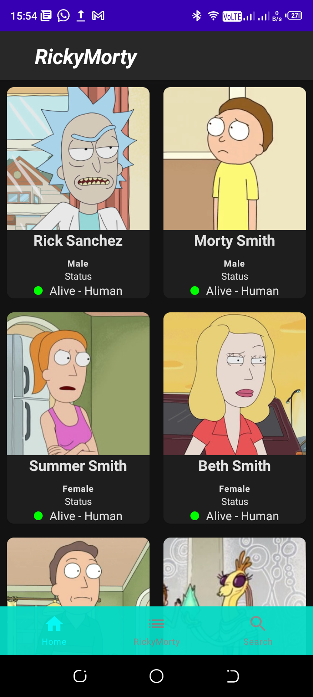

## RickyMorty App
- An android app that consumes RickyMorty API to display list of ricky morty characters. It is built using clean architecture principle, Repository pattern, MVVM Architecture in the presentation layer, Kotlin programming language
 and Jetpack Compose.

- Minimum API Level: 21 [Supports Over 84% Devices](https://developer.android.com)
- Build System: [Gradle](https://gradle.org/)

## Table of Contents
- [Prerequisite](#prerequisite)
- [Architecture](#architecture)
- [TechStack](#techstack)
- [Screenshots](#screenshots)
- [Demo](#demo)

## Prerequisite
- Inorder to run the application you need to [clone](https://github.com/alexymumo/RickyMorty.git).
- Android studio
 

## Architecture

## TechStack
- [Koin](https://insert-koin.io/) - Dependency Injection library.
- [Jetpack Components](https://developer.android.com/jetpack)
    - [Jetpack Compose](https://developer.android.com/jetpack/compose) - Modern toolkit for building native UI.
    - [Android KTX](https://developer.android.com/kotlin/ktx.html) - Provide concise, idiomatic Kotlin to Jetpack and Android platform APIs.
    - [AndroidX](https://developer.android.com/jetpack/androidx) - Major improvement to the original Android [Support Library](https://developer.android.com/topic/libraries/support-library/index), which is no longer maintained.
    -   [Lifecycle](https://developer.android.com/topic/libraries/architecture/lifecycle) - Perform actions in response to a change in the lifecycle status of another component, such as activities and fragments.
    -   [ViewModel](https://developer.android.com/topic/libraries/architecture/viewmodel) - Designed to store and manage UI-related data in a lifecycle conscious way. The ViewModel class allows data to survive configuration changes such as screen rotations.
    - [Room](https://developer.android.com/training/data-storage/room) - Provides an abstraction layer over SQLite used for offline data caching.
    - [Navigation Component](https://developer.android.com/guide/navigation/navigation-getting-started) - Component that allows easier implementation of navigation from simple button clicks to more complex patterns.

- [Retrofit](https://square.github.io/retrofit/) - Type-safe http client 
and supports coroutines out of the box.  
- [GSON](https://github.com/square/gson) - JSON Parser,used to parse 
requests on the data layer for Entities and understands Kotlin non-nullable 
and default parameters.
- [OkHttp-Logging-Interceptor](https://github.com/square/okhttp/blob/master/okhttp-logging-interceptor) - Logs HTTP request and response data.
- [Coroutines](https://github.com/Kotlin/kotlinx.coroutines) - Library Support for coroutines.
- [Flow](https://developer.android.com/kotlin/flow) - Flows are built on top of coroutines and can provide multiple values. A flow is conceptually a stream of data that can be computed asynchronously.
- [Timber](https://github.com/JakeWharton/timber) - Library for easier logging.
- [Coil](https://coil-kt.github.io/coil/compose/) - Image Library from loading images from the database and caching in memory.
- [kotlinx.coroutines](https://github.com/Kotlin/kotlinx.coroutines) - Library Support for coroutines,provides runBlocking coroutine builder used in tests.
 

  
## Screenshots
<table>
<thead>
<tr>
<th align="center">Splash Screen</th>
<th align="center">Character Grid</th>
<th align="center">Dark Mode</th>
</tr>
</thead>
<tbody>
<tr>
<td></td>
<td></td>
<td></td>
</tr>
</tbody>
</table>

 

https://user-images.githubusercontent.com/56880898/164644979-5532265b-4e48-469c-9742-5a4cf2072080.mp4

## Screenshots

## Screenshots
<table>
<thead>
<tr>
<th align="center">Splash Screen</th>
<th align="center">Character Grid</th>
<th align="center">Dark Mode</th>
</tr>
</thead>
<tbody>
<tr>
<td></td>
<td></td>
<td></td>
</tr>
</tbody>
</table>
